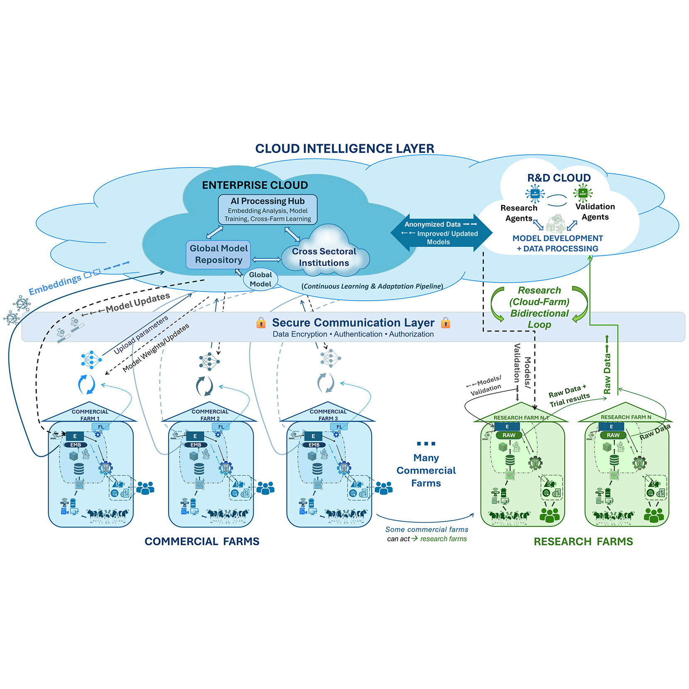
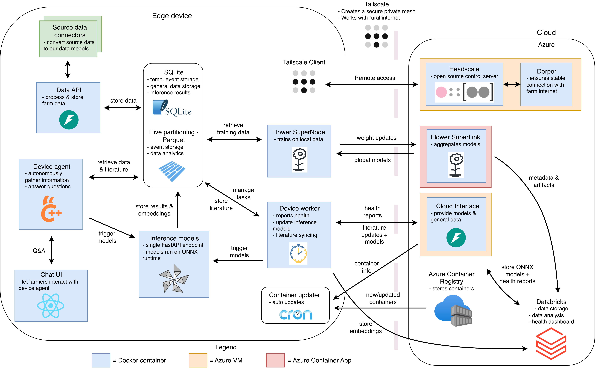

## Project Description
This project builds a privacy-first federated learning ecosystem for dairy farms. Based on the framework proposed in [@HOSTENS2025S9], the system enables machine learning models to be trained directly on edge devices at the farm level, ensuring sensitive raw data never has to leave the premises. The framework is visualized in the following figure: 

The framework consists of two main components: The cloud and the farms, which are connected through a secure networking layer. Farms train AI models locally using their private data. Updated model parameters are shared back to the cloud, where they are aggregated into global models. Research farms can also share raw data, which enables testing and pre-training of models inside the cloud.

Global models are shared back to farms, where they can inference using the private local data. Ultimately, the farmer can use natural language in a chat interface to interact with these models. This is facilitated by an autonomous AI agent that decides which models to use and what data to collect, building upon our foundational agentic prototype [@LIU202514038].

To successfully develop and deploy this framework, we must handle the heterogeneous data found in farms, as well as inconsistencies of how data is stored in different farms. For this, we develop an ontology for dairy farming. This will specify the various data found at a dairy farm (such as milk yield registration, cow birth, etc.) and the associated metadata. Such ontology enables conversion of each farm's local data into a standardized format, which in turn provides researchers with a single data format to build their models upon.

## Current Status

In 2026 up until now, we focused on developing the ontology and building the Minimum Viable Product (MVP) for the platform. Technical and research milestones include:

* **Ontology Development - Completed:** A comprehensive ontology defining various farm events has been developed. This specification allows us to standardize heterogeneous data across different farms, creating a consistent foundation for model training.
* **Technical Architecture - Completed:** We decided upon tooling, integration, and data flow, making numerous trade-offs to ensure a secure, reliable, cost-efficient and extensible platform. 
* **Cloud Development - Completed:** All cloud components are fully operational.
* **Edge Development - 95% Done:** All components with 2 exceptions are running on a development edge device. The user-facing chat UI and the agent remaining in development, guided by our benchmarking of privacy-preserving Small Language Models (SLMs) for constrained farm hardware [@liu2025evaluatingsmalllanguagemodels].
* **Secure Connectivity - Completed:** Using Tailscale, we can easily guarantee secure connectivity, providing authentication and data encryption.
* **Model Development:** Several models developed in the Bovi-Analytics lab can be deployed on or built upon for usage in the federated platform:
    * **Lactation Curve Modeling:** Utilizing various machine learning approaches to analyze and forecast milk yield.
    * **Computer Vision:** Memory-efficient, distilled vision pipelines optimized for edge accelerators (e.g., Jetson Orin NX) to perform individual-level monitoring and behavior classification [@yang2026lightweightdistillationsam3].
    * **Farm Simulation:** A neural surrogate model of the Ruminant Farm Systems (RuFaS) simulation model.
    * **LLM & Agentic Interfaces:** A conversational agent utilizing RAG for literature-backed decision support and providing a natural language interface to predictive models [@LIU202514038].
